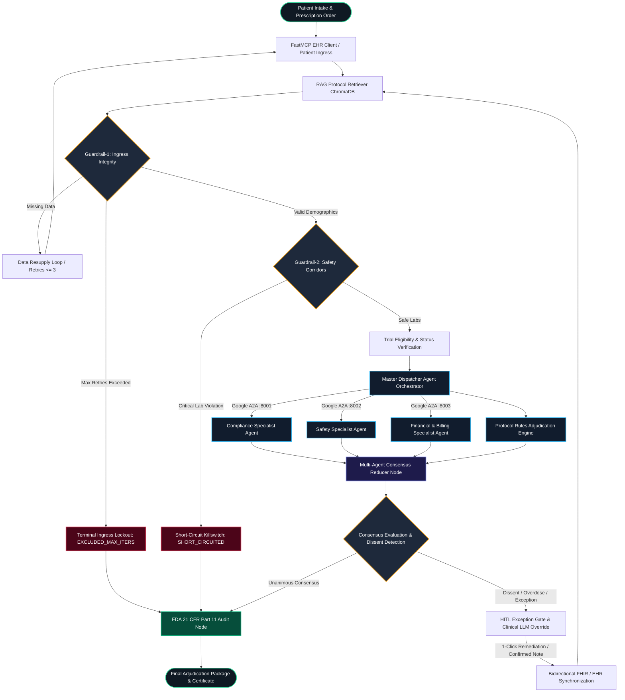

<div align="center">

# 🛡️ TrialGuard (TechQuest)
### Autonomous Multi-Agent Clinical Trial Adjudication, Regulatory Safety & Protocol Compliance Platform

[](https://github.com/google/a2a)
[](https://github.com/langchain-ai/langgraph)
[](https://modelcontextprotocol.io)
[](https://nextjs.org)
[](https://reactflow.dev)
[-0D9488?style=for-the-badge)](https://www.fda.gov)
[](https://python.org)

<p align="center">
  <strong>An institutional-grade, multi-agent AI engine designed to automate clinical trial eligibility review, protocol deviation auditing, safety contraindication checks, and sponsor financial coverage under strict regulatory compliance.</strong>
</p>

</div>

---

## 📑 Table of Contents

1. [Executive Summary & Core Innovations ("The Crazy Ideas")](#-executive-summary--core-innovations-the-crazy-ideas)
2. [High-Level System Architecture](#-high-level-system-architecture)
3. [Prerequisites](#-prerequisites)
4. [Installation](#-installation)
5. [Project Setup & Configuration](#-project-setup--configuration)
6. [Execution](#-execution)
7. [Evaluator Walkthrough & Expected Output](#-evaluator-walkthrough--expected-output)
8. [Comprehensive Test Patient Matrix](#-comprehensive-test-patient-matrix)
9. [Regulatory Compliance & Cryptographic Audit Trail](#-regulatory-compliance--cryptographic-audit-trail)
10. [Troubleshooting & FAQs](#-troubleshooting--faqs)

---

## 💡 Executive Summary & Core Innovations ("The Crazy Ideas")

Traditional clinical trial protocol adjudication is painfully manual: institutional review boards (IRBs) and principal investigators (PIs) spend weeks combing through electronic health records (EHR), lab panels, and trial protocol binders. Dosing errors, drug-drug interactions (DDI), and protocol violations cost pharmaceutical sponsors billions and compromise patient safety.

**TrialGuard** completely reimagines this workflow as a **decentralized multi-agent consensus network** combined with deterministic clinical safety corridors.

```
       [ EMR / FHIR Ingress ]
                 │
   ┌─────────────▼─────────────┐
   │ Guardrail-1: Schema/Demo  │ ──(Missing Data)──> [ Self-Healing Resupply Loop ]
   └─────────────┬─────────────┘
                 │ (Passed)
   ┌─────────────▼─────────────┐
   │ Guardrail-2: Safety Floor │ ──(Life-Threatening)─> [ SHORT-CIRCUIT KILLSWITCH ]
   └─────────────┬─────────────┘
                 │ (Passed)
   ┌─────────────▼─────────────┐
   │ Master Dispatcher Fan-Out │
   └──────┬───────────┬────────┘
          │           │
 ┌────────▼─────┐ ┌───▼──────────┐ ┌─────────────▼┐
 │  Compliance  │ │    Safety    │ │  Financial   │  <== Distributed Google A2A
 │  Specialist  │ │  Specialist  │ │  Specialist  │      Microservices (Ports 8001-8003)
 └────────┬─────┘ └───┬──────────┘ └─────────────┬┘
          │           │                          │
          └───────────┼──────────────────────────┘
                      ▼
        [ Multi-Agent Consensus Reducer ]
                      │
            (Dissent / Overdose)
                      ▼
   ┌─────────────────────────────────────┐
   │ HITL Exception Gate & Clinical LLM  │
   │  - Free-Text Doctor Note Extraction │
   │  - Fuzzy Spelling Typo Correction   │
   │  - 1-Click Protocol Remediation     │
   │  - Bi-Directional FHIR Sync         │
   └──────────────────┬──────────────────┘
                      │
                      ▼
    [ 21 CFR Part 11 Cryptographic Audit ]
```

### 🌟 7 Architectural Innovations

#### 1. Google A2A Distributed Microservice Consensus
Instead of relying on a monolithic prompt prone to hallucination contamination, TrialGuard decouples clinical reasoning into independent specialist microservices communicating via the **Google Agent-to-Agent (A2A) protocol** over HTTP / JSON-RPC 2.0 (`a2a.sendMessage`):
* **Protocol Compliance Agent** (`:8001`): Assesses trial arms, dosing intervals, and protocol inclusion criteria.
* **Safety Specialist Agent** (`:8002`): Evaluates drug-drug interactions, toxicity corridors, and adverse events.
* **Financial & Billing Agent** (`:8003`): Audits trial sponsor budget coverage, CMS/Medicare clinical trial billing policies, and patient out-of-pocket exposure.

#### 2. Two-Tier Ingress Guardrail Engine
* **Guardrail-1 (Schema Hygiene & Self-Healing Resupply Loop)**: Validates demographic and clinical integrity (DOB, biological sex, vital signs, trial mapping) under FDA 21 CFR 312.62. If data is missing, it triggers an automated **Data Resupply Loop** querying FastMCP EHR endpoints up to `MAX_REFINEMENT_ITERATIONS=3`. If the budget is exhausted without resolution, it enforces a permanent lockout (`EXCLUDED_MAX_ITERS`).
* **Guardrail-2 (Deterministic Catastrophic Safety Corridors)**: Evaluates life-threatening clinical contraindications (e.g., eGFR < 15 mL/min, Total Bilirubin > 5x ULN, ANC < 500/uL, intracranial hemorrhage) *before* any LLM inference occurs. It triggers an instant **Short-Circuit Killswitch** (`SHORT_CIRCUITED`), protecting patient safety and saving token compute.

#### 3. Hybrid RAG Protocol Knowledge Engine
Combines semantic vector search (ChromaDB + sentence-transformers) with deterministic clinical protocol parameter enforcement. Protocol binders (antithrombotic, oncology, SGLT2i renal, NAFLD/MASH) are parsed, chunked, and indexed with strict adherence to clinical trial parameters.

#### 4. Mathematical Multi-Agent Consensus Reducer
Gathers specialist verdicts, calculates weighted confidence vectors, detects dissenting opinions, and executes deterministic conflict resolution to reach a final adjudication verdict: `JUSTIFIED`, `NOT_JUSTIFIED`, or `REQUIRES_HITL`.

#### 5. HITL Exception Gate & Bidirectional FHIR Synchronization
When a protocol deviation or overdose occurs:
* Evaluates free-text physician narrative notes using Clinical LLM processing.
* **Fuzzy Typo Normalization**: Automatically recognizes and maps misspelled drug names (e.g., `"apixiban"` &rarr; `Apixaban`).
* **Conversational Filtering**: Flags non-actionable or purely conversational notes with an explicit `⚠️ Clinical Warning: Inappropriate or Ambiguous Doctor Note` banner, blocking unsafe submissions until resolved.
* **1-Click Protocol Remediation**: Provides a one-click button to instantly normalize non-compliant doses down to protocol-compliant ceilings in sub-millisecond local execution.
* **Bidirectional Database Writeback**: Directly synchronizes validated updates to in-memory registries, local disk JSON fixtures, and Supabase cloud tables.

#### 6. FDA 21 CFR Part 11 Tamper-Evident Audit Trail
Every agent execution, token exchange, consensus decision, and physician override is chained using **SHA-256 cryptographic hashes**, generating an immutable audit certificate and exportable clinical PDF/JSON reports.

#### 7. Command Center UI with Zero-Stutter ReactFlow Telemetry
Built on Next.js 16, React 19, and `@xyflow/react` v12. Employs fine-grained `React.memo` custom nodes, stabilized camera coordinates, and real-time Server-Sent Events (SSE) streaming for live visualization of multi-agent execution graphs without canvas jitter or unmount reloads.

---

## 🏛️ High-Level System Architecture



### Monorepo Structure

```
techquest/
├── apps/
│   ├── web/                     # Next.js 16 Command Center (React 19, @xyflow/react, Tailwind v4)
│   ├── gateway/                 # FastAPI Central Gateway & Ingress Router (:8000)
│   ├── agent-compliance/        # Protocol Compliance Agent Microservice (:8001, A2A)
│   ├── agent-safety/            # Clinical Safety Specialist Microservice (:8002, A2A)
│   ├── agent-financial/         # Financial & Billing Specialist Microservice (:8003, A2A)
│   ├── agent_master/            # Google A2A Master Client & Dispatcher
│   └── orchestrator/            # LangGraph State Machine, Nodes, Edges & Report Engine
├── packages/
│   ├── mcp-ehr/                 # FastMCP FHIR R4 Server & Patient Fixtures
│   ├── mcp-rag/                 # Protocol Retrieval Integration Stubs
│   ├── mcp-audit/               # 21 CFR Part 11 Cryptographic Audit Helpers
│   └── shared-schemas/          # Pydantic & TypeScript Data Models
├── services/
│   └── rag_service/             # ChromaDB Vector Store & Embedding Pipelines
├── scripts/
│   └── seed_comprehensive_patients.py # 17 Synthetic Patient Verification Fixtures
├── start_all.py                 # Multi-Service Process Orchestrator & Streamer
├── batch_audit.py               # Headless CLI Batch Adjudication Runner
├── visualize_graph.py           # LangGraph Topology Visualizer (ASCII, Mermaid, PNG)
├── pyproject.toml               # Python Workspace Monorepo Configuration
├── package.json                 # Turborepo Node.js Monorepo Configuration
└── .env.example                 # Comprehensive Environment Variables Template
```

---

## 💻 Prerequisites

Ensure your host machine meets the following requirements before installation:

### 1. Hardware & Operating System
* **Operating System**: macOS (Apple Silicon or Intel), Linux (Ubuntu 20.04+ / Debian 11+), or Windows 11 with **WSL2**.
* **Memory (RAM)**: Minimum 8 GB RAM (16 GB recommended for concurrent LLM streaming).
* **Disk Space**: At least 3 GB free disk space.

### 2. Software Runtimes
* **Python**: **Version 3.11 or higher** (Python 3.11 or 3.12 recommended). Verify with:
  ```bash
  python3 --version
  ```
* **Node.js**: **Version 20.x LTS or 22.x LTS**. Verify with:
  ```bash
  node --version
  ```
* **Package Managers**:
  * **`uv`** (Python package installer & workspace manager):
    ```bash
    curl -LsSf https://astral.sh/uv/install.sh | sh
    ```
  * **`pnpm`** (Fast, disk space efficient package manager):
    ```bash
    npm install -g pnpm@12.3.4
    ```

### 3. LLM Provider API Keys
TrialGuard supports multiple high-performance LLM inference providers. You need **at least one** of the following API keys:
* **Google Gemini API Key** (Default recommended for high throughput & structured output): [Google AI Studio](https://aistudio.google.com/)
* **OpenAI API Key** (Alternative provider): [OpenAI Platform](https://platform.openai.com/)
* **Groq API Key** (Fast Llama-3.3-70B inference): [Groq Console](https://console.groq.com/)
* *(Optional)* **Supabase**: URL and Anon/Service Role Key for cloud data persistence. If omitted, TrialGuard automatically falls back to local in-memory and disk-based FHIR storage without error.

---

## 📦 Installation

Follow these exact steps to install all monorepo dependencies across Python and TypeScript workspaces.

### Step 1: Clone the Repository
```bash
git clone https://github.com/TheDoomBoy-jab/techquest.git
cd techquest
```

### Step 2: Install Python Dependencies via `uv`
The repository uses a unified `uv` workspace linking all internal packages (`techquest-orchestrator`, `techquest-gateway`, `shared-schemas`, etc.):

```bash
# Create virtual environment and sync all monorepo Python workspace packages
uv sync
```

*(Alternative standard pip setup if not using `uv`:)*
```bash
python3 -m venv .venv
source .venv/bin/activate  # On Windows: .venv\Scripts\activate
pip install -r requirements.txt
pip install -e packages/shared-schemas
pip install -e packages/mcp-ehr
pip install -e apps/gateway
pip install -e apps/orchestrator
pip install -e apps/agent-compliance
pip install -e apps/agent-safety
pip install -e apps/agent-financial
pip install -e apps/agent_master
```

### Step 3: Install Frontend Dependencies via `pnpm`
Install the Node.js workspace dependencies for the Next.js 16 command center:

```bash
pnpm install
```

---

## ⚙️ Project Setup & Configuration

### Step 1: Configure Environment Variables
Copy the `.env.example` template into a new `.env` file at the root of the repository:

```bash
cp .env.example .env
```

Open `.env` in your text editor and provide your keys:

```ini
# ==============================================================================
# LLM Providers (Provide at least one valid key)
# ==============================================================================
GEMINI_API_KEY=AIzaSy...your_gemini_api_key_here
GEMINI_MODEL=gemini-2.5-flash
GEMINI_FALLBACK_MODELS=gemini-2.0-flash,gemini-1.5-flash

# Alternatively or concurrently:
OPENAI_API_KEY=sk-...your_openai_api_key_here
GROQ_API_KEY=gsk_...your_groq_api_key_here
GROQ_MODEL=llama-3.3-70b-versatile

# ==============================================================================
# Microservices & Google A2A Endpoints (Defaults configured for localhost)
# ==============================================================================
GATEWAY_PORT=8000
COMPLIANCE_FASTAPI_PORT=8001
SAFETY_FASTAPI_PORT=8002
FINANCIAL_FASTAPI_PORT=8003

A2A_COMPLIANCE_URL=http://127.0.0.1:8001/a2a
A2A_SAFETY_URL=http://127.0.0.1:8002/a2a
A2A_FINANCIAL_URL=http://127.0.0.1:8003/a2a

# Maximum iterations for Guardrail-1 demographic self-healing resupply
MAX_REFINEMENT_ITERATIONS=3

# Optional Supabase Database (Fallback to local JSON if blank)
SUPABASE_URL=
SUPABASE_SERVICE_ROLE_KEY=
NEXT_PUBLIC_SUPABASE_URL=
NEXT_PUBLIC_SUPABASE_ANON_KEY=
```

### Step 2: Seed & Verify Patient Data Fixtures
The repository comes pre-seeded with synthetic clinical profiles representing all test scenarios. Verify or regenerate the synthetic patient fixture:

```bash
uv run python scripts/seed_comprehensive_patients.py
```
*Output: `✓ Seeded 17 comprehensive synthetic clinical trial patients into local fixtures.`*

---

## 🚀 Execution

TrialGuard provides multiple execution modes depending on whether you want to run the complete interactive ecosystem, individual services, or automated CLI audits.

### Method 1: The One-Command Full Ecosystem Launcher (Recommended)

Run the unified orchestrator script. This boots all 5 microservices concurrently with real-time, color-coded terminal log multiplexing:

```bash
python3 start_all.py
```

```
==============================================================
  Starting TrialGuard Ecosystem (5 Services)
    - COMPLIANCE   -> http://localhost:8001
    - SAFETY       -> http://localhost:8002
    - FINANCIAL    -> http://localhost:8003
    - GATEWAY      -> http://localhost:8000
    - WEB          -> http://localhost:3000
==============================================================
```

Once running, open your web browser and navigate to:
👉 **`http://localhost:3000`**

To stop all services simultaneously, press `Ctrl + C` in the terminal. The process manager traps `SIGINT`/`SIGTERM` and gracefully tears down all child processes.

---

### Method 2: Running Services Individually in Separate Terminals

If you prefer to inspect individual services or debug specific microservices:

#### Terminal 1: Protocol Compliance Specialist Agent (Port 8001)
```bash
uv run python apps/agent-compliance/server.py
```

#### Terminal 2: Clinical Safety Specialist Agent (Port 8002)
```bash
uv run python apps/agent-safety/server.py
```

#### Terminal 3: Financial & Coverage Specialist Agent (Port 8003)
```bash
uv run python apps/agent-financial/server.py
```

#### Terminal 4: Central FastAPI Ingress Gateway (Port 8000)
```bash
uv run python apps/gateway/main.py
```

#### Terminal 5: Next.js Command Center Frontend (Port 3000)
```bash
pnpm --filter @techquest/web dev
```

---

### Method 3: Command-Line Batch Adjudication Audit

To evaluate the entire clinical cohort headlessly from the terminal without opening a browser:

```bash
uv run python batch_audit.py
```

**Sample Output:**
```
==========================================================================
  TRIALGUARD BATCH ADJUDICATION AUDIT: 17 PROFILES (NCT02415400)
==========================================================================

PID    | Name                   | Verdict    | Conf   | HITL   | Violations
------------------------------------------------------------------------
P034   | Sunita Rao             | JUSTIFIED  | 0.98   | False  | 0         
P036   | Michael Chang          | NOT_JUST   | 0.92   | True   | 1         
P038   | Ananya Deshmukh        | EXCLUDED   | 1.00   | False  | 1         
P039   | Robert Chen            | EXCLUDED   | 1.00   | False  | 1         
P041   | Elena Rostova          | SHORT_CIRC | 1.00   | False  | 1         
P042   | Marcus Vance           | SHORT_CIRC | 1.00   | False  | 1         
P043   | Priya Patel            | SHORT_CIRC | 1.00   | False  | 1         
```

---

### Method 4: Visualizing the LangGraph Orchestration Topology

To generate visual representations of the underlying state graph:

```bash
uv run python visualize_graph.py
```
*Outputs: ASCII representation in terminal, raw Mermaid markup in `orchestrator_graph.mmd`, and high-resolution visual flow in `orchestrator_graph.png`.*

---

## 🎯 Evaluator Walkthrough & Expected Output

When evaluating TrialGuard on **`http://localhost:3000`**, follow these test flows to observe the architectural innovations in action:

### 1. Test Case 1: Standard Compliant Patient (Unanimous Approval)
* **Select Preset**: Click the preset badge **`P034`** (or select `Sunita Rao`).
* **Prescription Order**: `Apixaban 5 mg oral twice daily` (Standard Arm A).
* **Click**: `Start Adjudication →`
* **Expected Telemetry**:
  1. **Ingress**: Passes Guardrail-1 demographic check.
  2. **Corridors**: Passes Guardrail-2 safety check (CrCl 68 mL/min > 30 mL/min threshold).
  3. **A2A Parallel Execution**: Compliance, Safety, and Financial agents process concurrently.
  4. **Consensus Verdict**: Returns **`JUSTIFIED`** in green with 100% trial sponsor coverage ($0 patient out-of-pocket).
  5. **Audit Certificate**: Tamper-evident SHA-256 hash generated.

---

### 2. Test Case 2: Guardrail-1 Demographic Failure & Self-Healing Lockout
* **Select Preset**: Click **`P038`** (Ananya Deshmukh, unrecorded biological sex) or **`P039`** (Robert Chen, unrecorded age).
* **Expected Telemetry**:
  1. Ingress detects missing required regulatory demographic fields under FDA 21 CFR 312.62.
  2. Initiates the **Data Resupply Loop** querying MCP EHR up to 3 times.
  3. Upon budget exhaustion, the patient is barred:
     `⛔ Patient ID Permanently Excluded (3/3 Retries Exhausted) · 21 CFR 312.62 Ingress Lockout`
  4. Submission button is safely locked.

---

### 3. Test Case 3: Guardrail-2 Pre-Inference Catastrophic Short-Circuit
* **Select Preset**:
  * **`P041`**: Severe End-Stage Renal Failure (eGFR 12.0 mL/min < 15.0 cutoff).
  * **`P042`**: Severe Hepatic Failure (Total Bilirubin 6.8 mg/dL > 5x ULN).
  * **`P043`**: Critical Agranulocytosis / Bone Marrow Toxicity (ANC 320 /uL < 500 threshold).
* **Expected Telemetry**:
  1. Guardrail-2 detects catastrophic organ failure corridors.
  2. **Zero LLM Tokens Wasted**: The pipeline immediately executes a **Short-Circuit Killswitch** (`SHORT_CIRCUITED`).
  3. Visual graph highlights red warning edges and bypasses specialist agents directly to the final audit log.

---

### 4. Test Case 4: Protocol Overdose, 1-Click Remediation & FHIR Sync
* **Select Preset**: Click **`P036`** (Michael Chang).
* **Initial Prescription**: `Apixaban 40 mg oral twice daily` (Overdose Violation: Trial limit is 5 mg BID).
* **Click**: `Start Adjudication →`
* **Expected Output**:
  1. Compliance Agent returns `NON_COMPLIANT`.
  2. Reducer outputs **`NOT_JUSTIFIED`** with an amber exception alert.
  3. The **HITL Exception Drawer** opens with a **`⚡ 1-Click Fix to Standard (Apixaban 5 mg oral twice daily)`** button.
  4. **Click the 1-Click Fix Button**:
     * Instantly (< 1ms local fast-track) normalizes the order to `Apixaban 5 mg oral twice daily`.
     * Click **`Confirm & Update FHIR Database`**: Synchronizes the updated dosage into the EHR records.
     * The ReactFlow graph automatically re-evaluates and switches the verdict to **`JUSTIFIED`** in real time!

---

### 5. Test Case 5: Free-Text Clinical LLM Note with Fuzzy Spelling Correction
* Open the **Modify Dosage / Override** drawer on any patient.
* In the doctor's narrative textarea, enter a note with intentional misspellings:
  > *"Patient exhibits stable renal function (CrCl 72 mL/min). Titrate apixiban to 5mg bid per protocol Arm A."*
* **Click**: `Evaluate Note via Clinical LLM`
* **Expected Output**:
  1. The LLM extracts the clinical intent.
  2. Displays badge: `Spelling Corrected: "apixiban" → Apixaban`.
  3. Formulates structured FHIR payload: Dosage `5 mg`, Route `oral`, Frequency `twice daily`, Timing `Every 12 hours (08:00, 20:00)`, Target Field: `MedicationRequest.dosageInstruction[0]`.
  4. Ready for one-click FHIR database commitment.

---

### 6. Test Case 6: Non-Clinical Chatter & Vague Note Rejection
* In the doctor's narrative textarea, enter conversational noise or vague directives:
  > *"Hello doctor, please accept this patient, it's a very nice day outside."*
* **Click**: `Evaluate Note via Clinical LLM`
* **Expected Output**:
  1. Flags: `⚠️ Clinical Warning: Inappropriate or Ambiguous Doctor Note`.
  2. Displays clinical explanation: *"The entered note does not specify an actionable medication name or numerical dosage."*
  3. Disables the submission button until an actionable clinical order is provided.

---

## 📊 Comprehensive Test Patient Matrix

TrialGuard ships with 17 specialized synthetic patients designed to test every permutation of the regulatory engine:

| PID | Patient Name | Trial Protocol | Scenario Category | Trigger Condition | Expected System Behavior |
|:---|:---|:---|:---|:---|:---|
| **P034** | Sunita Rao | NCT02415400 (Arm A) | ✅ Standard Compliant | Apixaban 5mg BID, normal CrCl | Unanimous `JUSTIFIED` approval (100% Covered) |
| **P038** | Ananya Deshmukh | NCT02415400 (Arm A) | 🛑 Guardrail-1 Ingress | Missing biological sex | Resupply loop &rarr; Excluded Lockout |
| **P039** | Robert Chen | NCT00699998 (Cohort B) | 🛑 Guardrail-1 Ingress | Missing patient age | Resupply loop &rarr; Excluded Lockout |
| **P040** | Evelyn Vance | NCT02415400 (Cohort C) | 🛑 Guardrail-1 Ingress | Missing baseline blood pressure | Resupply loop &rarr; Excluded Lockout |
| **P041** | Elena Rostova | NCT00699998 (Cohort B) | ⚡ Guardrail-2 Corridor | eGFR 12 mL/min (< 15 floor) | Pre-inference `SHORT_CIRCUITED` killswitch |
| **P042** | Marcus Vance | NCT00809965 (Cohort B) | ⚡ Guardrail-2 Corridor | Total Bilirubin 6.8 mg/dL (> 5x ULN) | Pre-inference `SHORT_CIRCUITED` killswitch |
| **P043** | Priya Patel | NCT02415400 (Cohort C) | ⚡ Guardrail-2 Corridor | ANC 320 /uL (< 500 agranulocytosis) | Pre-inference `SHORT_CIRCUITED` killswitch |
| **P036** | Michael Chang | NCT02415400 (Arm A) | ⚠️ Protocol Overdose | Apixaban 40mg BID (> 5mg cap) | `NOT_JUSTIFIED` &rarr; 1-Click Fix to Accept |
| **P044** | David Kim | NCT02415400 (Arm A) | ⚠️ Protocol Overdose | Apixaban 60mg BID (Extreme toxic dose) | `NOT_JUSTIFIED` &rarr; 1-Click Fix to Accept |
| **P045** | Sofia Alvarez | NCT02415400 (Arm A) | ⚠️ Washout Breach | 8 days since prior anticoagulant (< 30d) | RAG Rule violation &rarr; `NOT_JUSTIFIED` |
| **P046** | Arthur Pendelton | NCT00699998 (Cohort B) | ⚠️ Organ Boundary Floor | CrCl 22 mL/min (< 30 protocol floor) | RAG Rule violation &rarr; `NOT_JUSTIFIED` |
| **P047** | Maria Santos | NCT02415400 (Cohort C) | ⚠️ Protocol Exclusion | Active Systemic Lupus Erythematosus | Immunotherapy Autoimmune exclusion |
| **P048** | Lucas Scott | NCT02415400 (Arm A) | 🛑 A2A Safety DDI | Apixaban + Clarithromycin (CYP3A4 DDI) | Safety Agent Dissent &rarr; `NOT_JUSTIFIED` |
| **P049** | Naomi Campbell | NCT02415400 (Cohort C) | 🛑 A2A Financial Dissent | Off-label Pembrolizumab 400mg | Financial Agent Denies Coverage |
| **P050** | James Wilson | NCT00781573 (Arm A) | 🛑 A2A Tripartite Dissent | Multi-drug triple anticoagulant clash | Multi-agent deadlock &rarr; HITL Escalation |
| **P051** | Clara Oswald | NCT02415400 (Arm A) | ✅ Standard Compliant | Standard Antithrombotic protocol | Unanimous `JUSTIFIED` approval |
| **P052** | Ronald Miller | NCT02415400 (Cohort C) | ✅ Standard Compliant | Pembrolizumab 200mg IV Q3W | Unanimous `JUSTIFIED` approval |

---

## 🔒 Regulatory Compliance & Cryptographic Audit Trail

TrialGuard complies with international life sciences standards:

* **FDA 21 CFR Part 11 (Electronic Records & Signatures)**:
  * Audit records contain timestamp, user/agent ID, source data snapshot, mathematical verdict, and a computed **SHA-256 digital signature**.
  * Any post-decision modification is appended with a co-signing rationale and parent hash reference, guaranteeing an immutable audit chain.
* **FDA 21 CFR 312.62 & ICH E6(R2) Good Clinical Practice (GCP)**:
  * Enforces demographic and laboratory completeness before investigational product dispensation.
  * Barred subjects are logged in permanent regulatory lockout registries.
* **HL7 FHIR R4 Standard**:
  * Adheres to standard FHIR resources: `Patient`, `MedicationRequest`, `Observation` (lab panels and vital signs), and `Condition`.

---

## 🛠️ Verification Commands

Run these automated test suites to verify system health:

```bash
# 1. Run full web build validation (TypeScript + Next.js App Router)
pnpm --filter @techquest/web build

# 2. Run agent microservice contract tests
uv run python apps/agent-compliance/test_compliance.py
uv run python apps/agent-safety/test_safety.py
uv run python apps/agent-financial/test_financial.py

# 3. Check microservice health endpoints
curl -s http://localhost:8000/health | grep '"status":"ok"'
curl -s http://localhost:8001/health | grep '"status":"healthy"'
curl -s http://localhost:8002/health | grep '"status":"healthy"'
curl -s http://localhost:8003/health | grep '"status":"healthy"'
```

---

## ❓ Troubleshooting & FAQs

### Q1: `Error: listen EADDRINUSE: address already in use :::3000` (or 8000/8001/8002/8003)
**Cause**: A previous instance of the web app or an agent server is still bound to the port.  
**Resolution**: Free the port using `lsof` or kill existing Python/Node processes:
```bash
lsof -ti :3000,8000,8001,8002,8003 | xargs kill -9
```

### Q2: What if I don't have a Supabase account?
**Answer**: Supabase is completely optional! If `SUPABASE_URL` is left blank in `.env`, TrialGuard automatically falls back to high-performance in-memory state and local disk persistence (`packages/mcp-ehr/src/mcp_ehr/patients_expanded.json`). All features (including FHIR updates) will work out of the box.

### Q3: `Operation not permitted (os error 1)` when running Python
**Cause**: If executing inside a sandboxed CLI environment, Python execution may require permissions.  
**Resolution**: Run commands directly in your local terminal shell using `python3 start_all.py` or `uv run python start_all.py`.

### Q4: How do I test with an external LLM?
**Answer**: Set `GEMINI_API_KEY` or `OPENAI_API_KEY` in `.env`. TrialGuard features automated fallback logic: if one provider rate-limits or fails, the orchestrator gracefully switches to secondary models.

---

<div align="center">
  <sub>Developed for TechQuest Clinical AI Initiative · Built with Google A2A, LangGraph, FastMCP & Next.js 16</sub>
</div>
